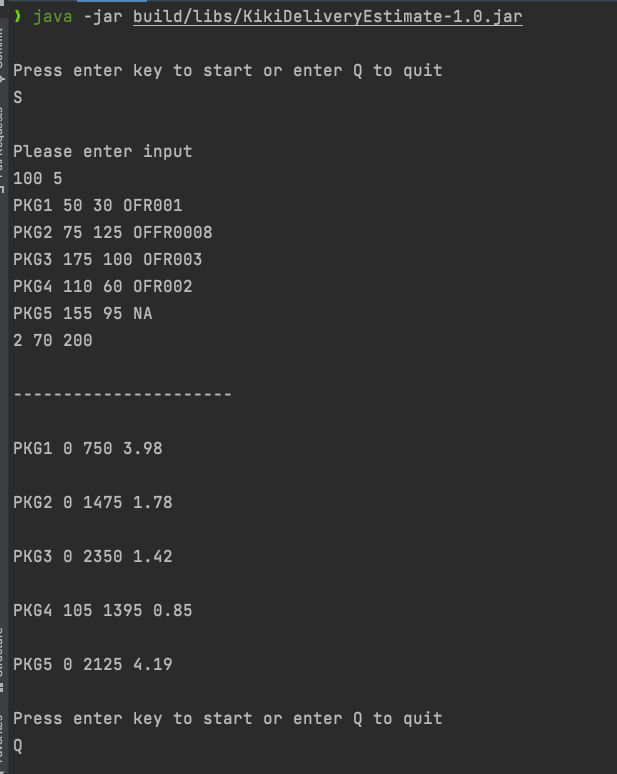
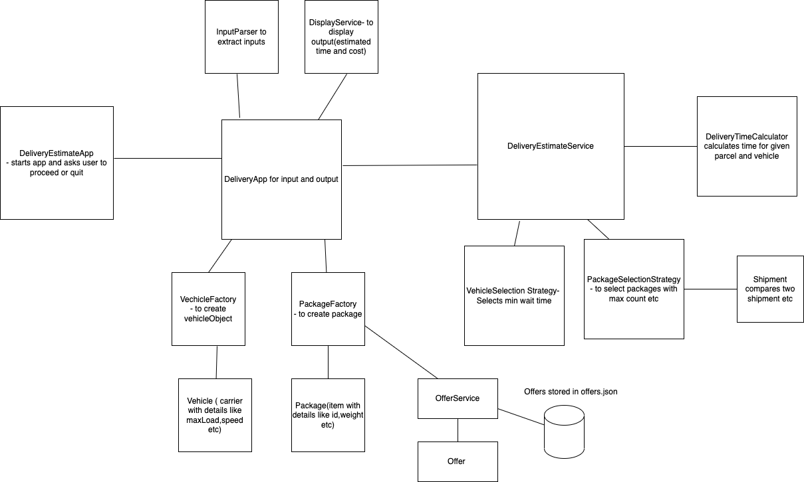

## Kiki Delivery Estimate App

is a courier service app which estimates the total delivery cost and delivery time of each package with offer code (if
applicable).

## System Requirements

1. JDK 13 or later
2. Gradle 7.1 or later

## Usage

1. To run all tests
    ```shell
    ./gradlew test
    ```
2. To build jar (App snapshot will be generated in `build/libs/<App>.jar` path)
   ```shell
   ./gradlew clean build
   ```


3. To start the application
   ```shell
    java -jar build/libs/KikiDeliveryEstimate-1.0.jar
   ```

## To Estimate cost and delivery time

1. Clean build app
   `./gradlew clean build`
2. Start the app
   `java -jar build/libs/KikiDeliveryEstimate-1.0.jar`
3. Provide input (like example below)



Note:
1. Package Weight is in Kilograms(KG)
2. Delivery Distance is in Kilometers(KM)
3. Max Speed is in KM/Hour
4. Estimated DeliveryTime is in hours

## Input and Output format

Input:

```
baseDeliveryCost  numberOfPackages
packageId1 packageWeight1 deliveryDistance1 offerCode1
packageId2 packageWeight2 deliveryDistance2 offerCode2
...
...
``` 

Output format:

```
packageId1 discountAmount1 totalCost1 estimatedDeliveryTime1
packageId2 discountAmount2 totalCost2 estimatedDeliveryTime2
...
...
``` 

### Architecture diagram




### Scope for improvement

1. Input parser can be improved with regex and groups.
2. Package selection strategy is little complex so can be improved.

